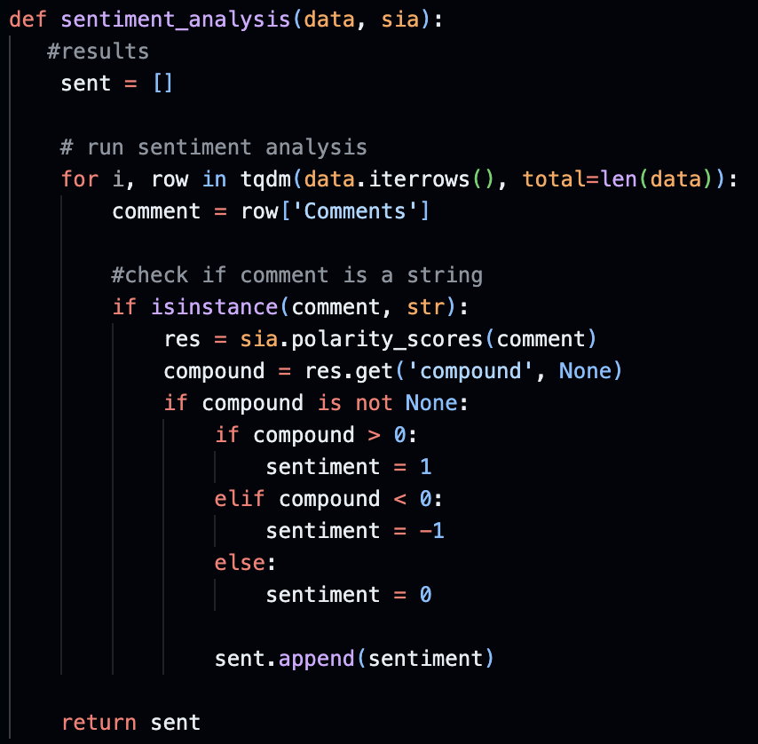

# YouTube Comment Sentiment Analysis

## Introduction
With around 3.7. million videos uploaded each day and over 1 billion hours watched every day it is safe to say that YouTube is the most popular video streaming site on the internet. While the videos uploaded are heavily analyzed by YouTube for any inappropriate content, the comments are not given the same attention. Are these YouTube comment sections war zones of malice just for arguing and degrading others, or are they positive and constructive environments where people can speak freely? With the use of sentiment analysis, it is possible to find out truly how positive (or negative) the YouTube comment section is.

## Questions
1. In general, do YouTube comments lean towards a more positive or negative sentiment? 
2. Which genre of YouTube videos tends to attract the most positive feedback in the comments section? 
3. What is the sentiment towards controversial topics on YouTube?

## Gathering Data
The data was gathered using the YouTube Data V3 API. This API allows the user to get lots of public data about videos such as comments, view counts, likes, dislikes, etc. In order to gather the data the ``get_youtube_comments()`` function was used.

This Function uses the ``googleapiclient`` toolkit to request youtube comments for a particular video ID from the API. This function was challenging to write having never used the API before, however once I got used to it development continued rapidly. In order to feed ``get_youtube_comments()`` specific video IDs they were all stored in arrays. The specific video ids were chosen by random sources. All videos are among the top videos in their category based on view count. The 6 categories were chosen by popularity on the platform, Gaming, Vlog, Music, Beauty, Reaction, and Controversial. The Controversial category consisted of multiple videos from multiple viewpoints of the Israel-Hamas conflict as it is very hot topic as of November 2023. After the comments were gathered they are stored in an array. The ``toCSV()`` takes this array of comments and puts them into a csv file. 

Each genre was put into its own data CSV. The data was then cleaned using ``clean_csv()``. 

Being a global website YouTube comments are in many different languages. The langid python library was use to filter the comments to english comments only. These comments were put into their own CSV files to keep the raw and clean data separate. Once the data was gathered and cleaned it was ready for sentiment analysis.

## Methods
Tools for gathering data/data manipulation
- googleapiclient - gathering data from YouTube comments
- pandas - to read csv and manipulate data
- csv - creating and populating csv files
- langid - filtering comments based on language
- numpy - array manipulation and math functions

Tools for Sentiment analysis and visualization
- NLTK - sentiment analysis
- TQDM - progress bar
- matplotlib - data visualization

The sentiment analysis of the YouTube comments was done using the ``sentiment_analysis()`` function. 

This function uses the built in NLTK ``SentimentIntensityAnalyzer()`` function to analyze the sentiment of each comment in a given csv. This function return 3 different values, the positive polarity, the negative polarity and the compounded polarity. This analysis a polarity greater zero was deemed as positive, a polarity less than zero was deemed as negative, and a polarity of 0 was neutral. This was done so that all the comments would be either positive negative or neutral. This was done with every comment in a given csv adn added to the array ``sent``. This data was then totaled up per video. This portion of was done with the ``get_sent_totals()``.

## Results and Discussions

### Question 1 | In general, do YouTube comments lean towards a more positive or negative sentiment? 
In order to answer this question the whole data set must be taken into account. To do this, all the positive data was added up based on positive, negative and neutral comments. Then the percentages were calculated for both the clean and raw data. The analysis of both the raw and clean data was taken to see the discrepancies between the both.

With 59% neutral for the raw data and 70% for the cleaned data it is clear that the majority of comments on YouTube are neutral. After the neutral 30% of the raw and 25% of the clean comments are positive, followed by 10% and 3% for the negative percentage of the raw and clean respectively. Youtube is primarily neutral and positive. With approximately 10% or less of negative comments on the site, it is safe to say that YouTube is an overall positive website. 

### Question 2 | Which genre of YouTube videos tends to attract the most positive feedback in the comments section?
In order to answer this question, all genres need to be taken into account. This is simple because all the data is already separated by genre.

#### Beauty

The neutral beauty comments are between 50% and 60% for both the raw data and clean data. 41% of raw comments and 32% of clean comments were positive. Negative comments were under 10% for both.

#### Controversial

The differences between the raw and cleaned data for controversial is drastic. The neutral comments for were 42% and 64% for the raw and clean. The positive percentage was more similar with 25% and 28% for the raw and clean percentages. The variance comes with the negative percentage. The cleaned comments have a similar percentage to the beauty videos with 7%. The raw data had a percentage of 31%. This discrepancy is likely due to the language filtering. While the confidence was set to 0.5 when cleaning the data many english comments could have been potentially filtered out. It is also unknown what non-english phrases are scored in terms of positive or negative polarity. Because of these facts the results of the raw controversial data cannot be trusted. 

#### Gaming

The gaming comment graphs were remarkable similar with 58% and 65% for the neutral comments, 34% and 30% for positive, and finally 7% and 3% for the negative.

#### Music

The music comments were primarily neutral with 71% and 83%. This is likely due to users commenting about the song an potential lyrics instead of how they feel towards the song or artist. The positive percentage was 22% and 14% with the negatives 6% and 2%.

#### Reaction

There is a difference between the neutral percents with the raw having 58% and clean having 75%. The positive percentages were 30% and 18%. The negative percentages were 11% and 6%. It is challenging to figure out why there is such a big difference in the percentage of neutral comments. However it is most likely due to the NLTK toolkit and its limitations.

#### Vlog

The vlog percentages are very similar with 58% and 64% for the neutral comments, 32% and 30% for positive and 9% and 5% for negative comment percentage.

#### Analysis
These pi charts tell us a lot about the comments and the genre of video. Beauty videos have the highest positive percentage with 32.8% positive. This is predicted by the genre, most of the comments are talking about how beautiful the creator is or certain makeup, etc. Controversial video comments have the highest negative percentage with 7.7% negative. This is due to the controversial nature of the video and the conflict spreading to the comment section of the video. We can see this positive sentiment percentages for each genre in the following bar graphs.

### Question 3 | What is the sentiment towards controversial topics on YouTube?
When it comes to the sentiment of controversial video comments this can be looked at through the previous pi charts.

While the negative percentage of the raw data is very high, this cannot be trusted because the sentiment of non-english phrases is not known. The bar graph below can further show the negative sentiment of controversial video comments compared to the other categories.

Controversial video comments have the highest percentage of negative comments. This is likely due to the nature of controversy and may people are arguing in the comment section. However this negative percentage is only 7.7%, meaning that thw other 92.3% is either neutral or positive. While the controversial videos may have the highest percentage of negative comments, overall they are not very negative at all. Therefore it can be said that the sentiment towards controversial videos on youtube is mostly neutral or positive.

### Conclusion and Closing Thoughts
When it comes to the YouTube comment section, it is mostly neutral and positive no matter the genre and when it comes to controversial videos they follows the general distribution of positive neutral and negative comments. 

Sentiment analysis is an incredibly powerful tool for processing natural language. The model that was used in this analysis was pertained and already built in to NLTK. To better this analysis a custom build model or a better version could have offered better results, however they are more challenging to use and taxing on the components of a system.

Overall, this project furthered my understanding and knowledge of data science while challenging me at the same time.

